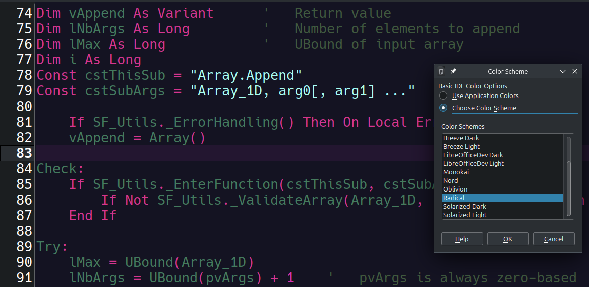

# Extra Basic IDE Color Schemes

This extension provides additional color schemes for LibreOffice's Basic IDE.

> [!NOTE]
> Support for color schemes in the Basic IDE was added in LibreOffice 24.8, hence this extension is only supported by LibreOffice 24.8 or newer.

## Installation

1. Download the latest OXT file from the "Releases" page.
2. Open LibreOffice and go to **Tools - Extensions** and click **Add**.
3. Select the OXT file and install it.
4. After accepting the license, restart LibreOffice.

## About the Color Schemes

The color schemes available in this extension were inspired by the color schemes available in the Kate text editor.
